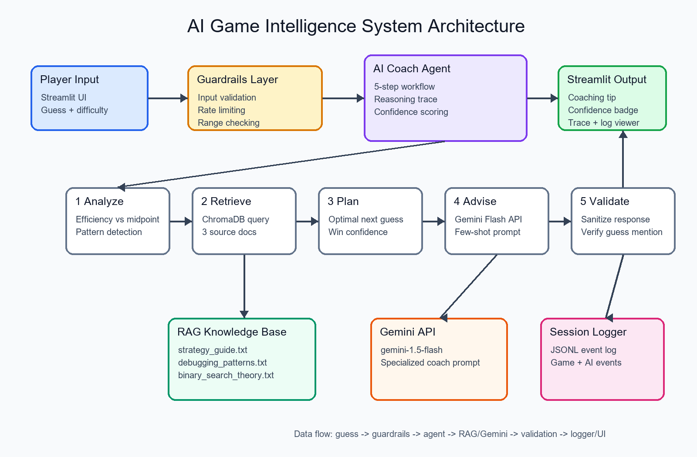
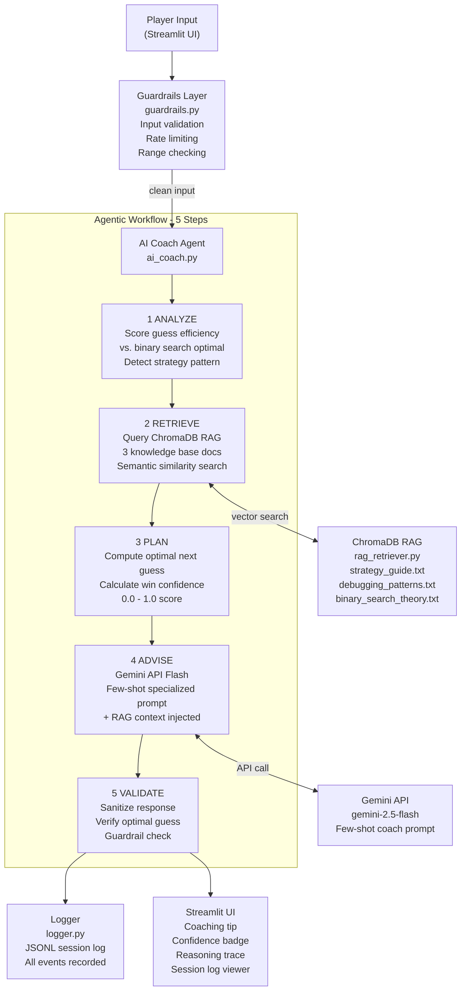

# AI Game Intelligence System

An applied AI extension of a number-guessing game that turns each player guess into strategy feedback using an agentic workflow, RAG, guardrails, and evaluation.

## Base Project Reference

This project extends **Game Glitch Investigator (AI110 Module 1)**. The original project was a Streamlit guessing game used to debug AI-generated code defects around comparison logic, state persistence, input parsing, and scoring. Its goal was to separate game logic into testable functions and prove the core game worked with pytest.

## Architecture Overview

The AI system wraps the original game with a five-step agent: Analyze, Retrieve, Plan, Advise, and Validate. A validated guess flows into the coach, the coach retrieves strategy context from three local knowledge documents, Gemini generates a concise coaching tip, and the output is sanitized and logged before display.





## AI Features

- **Agentic Workflow:** `ai_coach.py` exposes an observable five-step chain for each guess and stores a reasoning trace for review.
- **RAG:** `rag_retriever.py` indexes three custom documents covering guessing strategy, binary search theory, and debugging patterns.
- **Specialization Prompt:** Coach Binary uses a few-shot prompt that teaches Gemini a concise, strategy-first coaching style.
- **Guardrails and Logging:** Inputs are validated, AI responses are sanitized, rate limits are enforced, and events are written to JSONL.

## Setup Instructions

1. Clone the repo: `git clone <repo-url> && cd applied-ai-game-intelligence`
2. Install dependencies: `pip install -r requirements.txt`
3. Set the Gemini key in `.env`: `GEMINI_API_KEY=your_key_here`
4. Run tests: `pytest`
5. Run the evaluation harness: `python eval_harness.py`
6. Launch the app: `python -m streamlit run app.py`

## Sample Interactions

**Guess:** `2` on Normal mode after starting a 1-100 game.  
**Coach:** "That guess is far from the midpoint, so it leaves too much search space. Binary search starts at 50 because it cuts 1-100 in half. Your optimal next guess is 51 if the result was Too Low."

**Guess:** `75` and the game says Too High.  
**Coach:** "Since 75 was too high, your new possible range is 1-74. The midpoint is 37, which gives you the most information from the next attempt. Your optimal next guess is 37."

**Guess:** `40` and only two attempts remain.  
**Coach:** "You are in the urgent zone, so use the exact midpoint instead of guessing by feel. The next guess should split the remaining range and preserve your best chance to win. Your optimal next guess is 70."

## Evaluation

Example output from `python eval_harness.py`:

```text
======================================================================
  AI GAME INTELLIGENCE SYSTEM - EVALUATION HARNESS
  AI110 Module 9 | Game Glitch Investigator Extension
======================================================================

  RESULTS: 18/18 tests passed
  CONFIDENCE (passing tests): 95% average
  LATENCY: 120ms average per test

  All tests passed. System is reliable.
======================================================================
```

The harness checks original logic, guardrails, agent analysis, planning, RAG indexing, retrieval, and a simulated binary-search game.

## Design Decisions

- **In-memory ChromaDB:** Keeps setup simple for Streamlit reruns and avoids committing a local vector database. The trade-off is that documents are re-indexed per process.
- **Rule-based fallback:** Gemini failures should not break the game, so the coach returns deterministic binary-search advice when the API is unavailable.
- **Visible reasoning trace:** The app exposes the agent's intermediate steps for grading and debugging, although a production classroom app might hide this behind an instructor toggle.
- **Three-document RAG base:** Strategy, theory, and debugging sources keep retrieval focused while satisfying the multi-document stretch goal.

## Testing Summary

The original game logic remains covered by `tests/test_game_logic.py`, and the new system is covered by `tests/test_ai_coach.py` plus `eval_harness.py`. API calls are not required for automated tests, which keeps the suite deterministic; the remaining external risk is live Gemini latency or quota during interactive use.

## Reflection

This project made the difference between "calling an LLM" and engineering an AI system much clearer. The useful behavior comes from structured state, retrieval, guardrails, fallbacks, and tests around the model call.

## Loom Video

[Watch the demo walkthrough](YOUR_LOOM_LINK_HERE)

## Portfolio Statement

This project shows that I can take a small tested app and turn it into an applied AI product with observable agent behavior, retrieval, safety checks, documentation, and automated evaluation.
